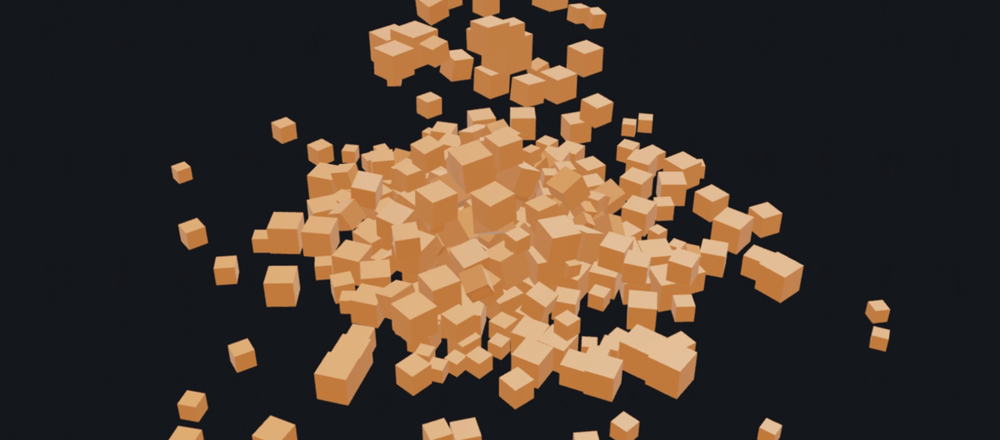

# tcxPhysics



> ⚠️ **Work in progress.** This addon works, but it's early — **the API may still
> change without notice** between versions. Pin a commit/tag if you need stability.
> Feedback welcome. [Live web demo →](https://tettou771.github.io/tcxPhysics/)

3D rigid body physics for [TrussC](https://github.com/TrussC-org/TrussC), powered by
[Jolt Physics](https://github.com/jrouwe/JoltPhysics) (the engine behind *Horizon
Forbidden West* and *Death Stranding 2*).

Throw hundreds — thousands — of simple primitives (boxes, spheres) into a scene
and let them tumble. Jolt is multi-core on desktop and **runs on the web**
(Emscripten / WebAssembly) too, automatically falling back to a single-threaded
job system there.

> Jolt is fetched and built for you via CMake `FetchContent` — no manual setup.
> It's the 2D addon `tcxBox2d`'s 3D sibling.

---

## Quick start

```cpp
#include <TrussC.h>
#include <tcxPhysics.h>
using namespace std;
using namespace tc;
using namespace tcx;

class tcApp : public App {
    EasyCam cam;
    PhysicsWorld world;
    Mesh cube;
    vector<PhysicsBody> blocks;

    void setup() override {
        // Metre-scale scene (see "Units & scale"): default gravity -9.81 is natural.
        cam.setTarget(0, 0.5f, 0);
        cam.setDistance(5);
        cam.setElevation(0.4f);               // oblique 3/4 view
        cam.enableMouseInput();
        cube = createBox(1.0f);

        world.setup();
        world.addGroundPlane(0.0f);           // static floor at y = 0
    }

    void update() override {
        // drop a ~0.2 m block each frame
        blocks.push_back(world.addBox(Vec3(random(-0.5f, 0.5f), 3, 0), Vec3(0.2f)));
        world.update(1.0f / 60.0f);           // step the simulation
    }

    void draw() override {
        clear(0.1f, 0.1f, 0.12f);
        cam.begin();
        for (auto& b : blocks) {
            pushMatrix();
            translate(b.getPosition());
            rotate(b.getRotation());
            Vec3 s = b.getSize();
            scale(s.x, s.y, s.z);
            cube.draw();
            popMatrix();
        }
        cam.end();
    }
};
```

See **`example-cubeRain/`** for the full version: hold the mouse to pour ~100
apple-red cubes per second into a pile, lit with a key + fill light, with a live
cube count and FPS readout.

---

## API

### `PhysicsWorld`

| Method | What it does |
|--------|--------------|
| `setup(maxBodies = 10240)` | Initialize the simulation. Call once. |
| `setGravity(Vec3)` / `getGravity()` | Gravity vector (default `(0, -9.81, 0)`). |
| `update(dt = 1/60, collisionSteps = 1)` | Step the simulation once per frame. |
| `addBox(pos, size, dynamic = true, density = 1000)` | Add a box. `size` is full extents; `pos` is its center. `mass = density × volume`. Returns a `PhysicsBody`. |
| `addSphere(pos, radius, dynamic = true, density = 1000)` | Add a sphere. |
| `addCapsule(pos, radius, cylinderHeight, dynamic = true, density = 1000)` | Y-axis capsule (cylinder + 2 hemispheres). Draw with `createCapsule(radius, cylinderHeight)`. |
| `addCylinder(pos, radius, height, dynamic = true, density = 1000)` | Y-axis cylinder. Draw with `createCylinder(radius, height)`. |
| `addConvexHull(pos, mesh, dynamic = true, density = 1000)` | Convex hull of a mesh's **vertices** (triangles/concavity ignored). For arbitrary *convex* dynamic bodies. |
| `addMesh(pos, mesh, dynamic = false)` | Triangle-mesh collider — **any geometry incl. concave**, but **static only** (no mass). For terrain / level scenery. |
| `addGroundPlane(y = 0, size = 100000)` | A large static floor centered on `(0, y, 0)`. |
| `raycast(origin, direction, maxDistance = 1e6)` | Cast a ray, return the closest `RaycastHit` — see [Raycasting](#raycasting). |
| `removeBody(body)` | Remove one body. |
| `clearDynamicBodies()` | Remove every dynamic body, keep static scenery. |
| `getNumBodies()` | Total body count. |
| `addJoint(a, b, def)` / `addJoint(a, def)` | Constrain two bodies (or one body to the world) — see [Joints](#joints). |
| `removeJoint(j)` / `getJoints()` / `getJointsForBody(id)` | Remove / list live joints (lightweight `PhysicsJoint` handles). |
| `setBodyMotionType(id, MotionType)` / `moveBodyKinematic(id, pos, rot, dt)` | Switch a body's motion type / drive a kinematic one — see [Kinematic bodies](#kinematic-bodies). |
| `setBodyIsSensor(id, bool)` / `isBodySensor(id)` | Make a body a trigger (sensor) — see [Sensors (triggers)](#sensors-triggers). |
| `updateAsyncStart(hz = 120)` / `updateAsyncStop()` / `isAsync()` | Step on a fixed-timestep clock — see [Async stepping](#async-stepping). |
| `contactBegan` / `contactPersisted` / `contactEnded` | `tc::Event<ContactEventArgs>` — see [Contact events](#contact-events). |
| `nativeSystem()` / `nativeBodyInterface()` | Raw Jolt pointers (`void*`) — see [Advanced: raw Jolt](#advanced-raw-jolt-escape-hatch). |

`dynamic = false` makes a body static (floor, walls, scenery) — it never moves
but everything collides against it.

### `PhysicsBody`

A lightweight copyable handle (world pointer + id). It owns nothing; the body
lives in the `PhysicsWorld`. The setters return `*this`, so they chain.

| Method | What it does |
|--------|--------------|
| `isValid()` | False if default-constructed or the body was removed. |
| `getPosition()` → `Vec3` | World-space center. |
| `getRotation()` → `Quaternion` | World-space orientation (feed to `rotate()`). |
| `getSize()` → `Vec3` | Full extents of the shape's bounding box. |
| `applyForce(f)` / `applyForce(f, worldPoint)` | Accumulating push (world-space), applied over the next step. |
| `applyTorque(t)` | Accumulating spin. |
| `applyImpulse(i)` / `applyImpulse(i, worldPoint)` | One-shot kick (changes velocity instantly). |
| `applyAngularImpulse(i)` | One-shot spin kick. |
| `addVelocity(dv)` | Mass-independent kick: adds straight to the velocity (Δv). The intuitive "shove" — think in units/sec, not mass × impulse. |
| `getMass()` → `float` | Mass in sim units (`density × volume`). |
| `setLinearVelocity(v)` / `getLinearVelocity()` | Direct linear velocity. |
| `setAngularVelocity(v)` / `getAngularVelocity()` | Direct angular velocity. |
| `setPosition(p)` / `setRotation(q)` | Teleport (snaps transform, no collision sweep — for spawn/reset). |
| `setMotionType(MotionType)` | Switch between `Static` / `Kinematic` / `Dynamic`. |
| `moveKinematic(pos, rot, dt)` | Drive a kinematic body so it pushes dynamics with real momentum (call each frame). |
| `setSensor(bool)` / `isSensor()` | Make this body a trigger — detects overlaps, blocks nothing. |
| `setFriction(f)` / `getFriction()` | `0` = ice, `~1` = grippy. |
| `setRestitution(r)` / `getRestitution()` | `0` = dead, `1` = full bounce. |
| `activate()` / `isActive()` | Wake / query a sleeping body. |

Forces, impulses and velocity are no-ops on non-dynamic bodies, and they wake the
body for you. Example: `example-forces/` (impulse + force) and `example-bounce/`
(restitution side by side).

---

## Shapes

The collider and the rendered mesh are **separate** — `getSize()` returns the
shape's local **AABB**, which only equals the drawable size for box/sphere. Draw
each shape with the matching mesh:

| Collider | Draw with |
|----------|-----------|
| `addBox` / `addSphere` | a unit `createBox`/`createSphere` scaled by `getSize()` |
| `addCapsule(r, h)` / `addCylinder(r, h)` | `createCapsule(r, h)` / `createCylinder(r, h)` |
| `addConvexHull(mesh)` / `addMesh(mesh)` | the **same `tc::Mesh`** you passed in |

Convex vs. mesh: `addConvexHull` is light and can be **dynamic**, but rounds the
input to its convex hull. `addMesh` keeps arbitrary (incl. concave) geometry but
is **static only**. To move a concave shape, approximate it with one hull or a set
of hulls (convex decomposition). See `example-shapes/`.

---

## Contact events

Subscribe to collisions with the `tc::Event`s on `PhysicsWorld`. Handlers fire on
the **main thread** — `tcxPhysics` collects Jolt's worker-thread contacts and
replays them during `update()` (or, in async mode, on the frame loop) — so it's
safe to touch app / render state from inside one.

```cpp
EventListener onHit;   // keep it alive (RAII; disconnects on destroy)

void setup() override {
    onHit = world.contactBegan.listen([](ContactEventArgs& c) {
        // c.a, c.b      : the two bodies (copyable handles)
        // c.point       : world-space contact point
        // c.normal      : world-space normal (a → b)
        // c.speed       : approach speed at impact — great for hit sfx/vfx volume
        playClick(c.speed);
    });
}
```

`contactPersisted` fires every step while a pair keeps touching (can be a lot of
events), and `contactEnded` fires when a pair stops touching (its
`point`/`normal`/`speed` are zero — only the body pair is meaningful). Example:
`example-collision/`.

---

## Raycasting

Cast a ray into the world and get the closest body it hits:

```cpp
RaycastHit hit = world.raycast(origin, direction, /*maxDistance*/ 100.0f);
if (hit) {                 // contextually convertible to bool
    hit.body;              // the PhysicsBody struck (a handle)
    hit.point;             // world-space impact point
    hit.normal;            // outward surface normal there
    hit.distance;          // distance along the ray
}
```

`direction` need not be normalized. Static, kinematic and dynamic bodies are all
hit; sensors are skipped. For **mouse picking**, build the ray from the camera —
`origin = cam.getPosition()`, `direction = screenToWorld(getMousePos(), 0) - origin`
— and cast it. Example: `example-raycast/`.

---

## Sensors (triggers)

A **sensor** detects overlaps but produces no collision response — bodies pass
straight through it. It still reports its overlaps through the normal contact
events, so it's perfect for trigger volumes (goals, pickups, zones):

```cpp
PhysicsBody zone = world.addBox(Vec3(0, 1, 0), Vec3(2), /*dynamic*/ false);
zone.setSensor(true);   // now things fall through it but it still reports contacts
```

A static sensor detects the dynamic bodies that move through it. Example:
`example-trigger/`.

---

## Kinematic bodies

A **kinematic** body is one *you* move (it ignores gravity and impacts) that still
pushes the dynamic bodies it meets — ideal for moving platforms, paddles and doors:

```cpp
PhysicsBody platform = world.addBox(Vec3(0, 1, 0), Vec3(2, 0.3f, 2));
platform.setMotionType(MotionType::Kinematic);
// each frame, drive it toward a new transform; Jolt derives the velocity so it
// shoves dynamics with the right momentum (unlike setPosition, which teleports):
platform.moveKinematic(targetPos, targetRot, getDeltaTime());
```

Example: `example-kinematic/`.

---

## Joints

Constrain two bodies to each other — or one body to the world — with a `Joint`
description (named factory + chainable options):

| Factory | What it makes |
|---------|---------------|
| `Joint::point(worldPivot)` | Ball joint: pins the bodies at one point. Chains, ragdolls. |
| `Joint::hinge(worldPivot, axis)` | Rotation around one axis. Doors, wheels. `.limits(min, max)` (rad). |
| `Joint::slider(axis)` | Straight travel along an axis, no rotation. Pistons. `.limits(min, max)` (m). |
| `Joint::distance(anchorOnA, anchorOnB)` | Keeps two points at a distance. `.range(min, max)`, `.spring(hz, damping)`. |
| `Joint::fixed()` | Welds the bodies in their current relative pose. |

The **node-level** way (RigidBody mod) is the main API:

```cpp
// door / frame are Nodes with a RigidBody mod each
door->getMod<RigidBody>()->jointTo(frame,
    Joint::hinge(edgePos, Vec3(0, 1, 0)).limits(-TAU/4, TAU/4));

// hang a ball from the air, springy
ball->getMod<RigidBody>()->jointToWorld(
    Joint::distance(ballPos, hook).spring(2.0f, 0.2f));
```

The **world-level** way takes raw bodies (`world.addJoint(a, b, def)`).

The world owns every joint and hands out `PhysicsJoint` **handles** (world + id,
like `PhysicsBody`): copy them freely, nothing to manage. Query them any time:

```cpp
for (auto& j : defaultWorld().getJoints()) j.drawWire();   // visualize all
auto mine = rb->getJoints();                               // joints touching this body
j.getAnchorA(); j.getAnchorB(); j.getAxis();               // live world-space values
j.remove();                                                // explicit removal
```

Removing a body (or destroying its node) **automatically removes every joint
touching it** — a joint can never dangle.

**Timing note:** both bodies must exist when you wire a joint. A RigidBody added
inside a Node subclass's `setup()` is only created on the node's first frame —
wire joints the frame after spawning, or add the mods from app code
(`node->addMod<RigidBody>(...)` creates the body immediately).

Example: `example-joints/`. (For constraint types not wrapped yet —
cone, 6-DOF, motors — use the [raw Jolt escape hatch](#advanced-raw-jolt-escape-hatch).)

---

## Async stepping

By default you step the sim yourself with `update(dt)`. Alternatively, run it on
its own fixed-timestep clock so physics stays stable regardless of frame rate:

```cpp
world.updateAsyncStart(240);   // background thread stepping at 240 Hz
// ...don't call update() while async; body reads / force calls stay safe...
world.updateAsyncStop();
```

Reads and force/velocity calls are serialized against the step, so they remain
safe while the worker runs. Contact events still fire on the main thread.

**Web:** WebAssembly has no background threads, so async transparently falls back
to fixed-timestep stepping driven by the frame loop (logged once as a warning) —
same API, no code change. Example: `example-fixedTimestep/`.

---

## Advanced: raw Jolt (escape hatch)

The wrapper covers the common cases; for anything it doesn't surface yet
(constraints/joints, ray & shape casts, custom shapes, damping, …) reach straight
into Jolt:

```cpp
#include <tcxPhysics.h>
#include <tcxPhysicsJolt.h>          // opt in to raw Jolt

JPH::BodyInterface& bi = joltBodyInterface(world);
bi.SetLinearDamping(joltBodyId(myBody), 0.2f);   // a feature not wrapped
JPH::PhysicsSystem& sys = joltSystem(world);      // constraints, queries, settings…
```

Two things this costs you (both by design — it's why the default build is clean):

1. **Build.** Jolt is linked `PRIVATE` to the addon, so its headers and `JPH_*`
   compile defines don't reach your app. To use the hatch your app must link the
   same `Jolt` target — one line, ideally in a committed **`local.cmake`** so it
   survives `trusscli update`:

   ```cmake
   # local.cmake
   if(TARGET Jolt)
       target_link_libraries(${PROJECT_NAME} PRIVATE Jolt)
   endif()
   ```

   Linking the *same* target guarantees headers **and** defines match — mismatched
   `JPH_*` defines silently change struct layouts (ABI breakage).

2. **Threading.** These calls go straight to Jolt and bypass the step lock. With
   synchronous `update()` you're fine (main thread, between steps); in async mode
   call `updateAsyncStop()` first (or take your own lock).

Full working example: **`example-joltNativeAccess/`** — builds a ball-jointed
hanging chain using Jolt constraints, with the `local.cmake` shown above.

---

## Examples

| Example | Shows |
|---------|-------|
| `example-cubeRain/` | The headline demo — pour cubes into a pile. |
| `example-shapes/` | Every shape (box/sphere/capsule/cylinder/convex-hull) raining onto a static triangle-mesh terrain. |
| `example-forces/` | `applyImpulse` / `applyForce` / `addVelocity` (click to explode, hold to levitate, V to jump). |
| `example-bounce/` | `setRestitution` / `setFriction` — a row of spheres, dead → bouncy. |
| `example-collision/` | `contactBegan` events — flash + spark + count on impact. |
| `example-raycast/` | `raycast` — mouse-pick the body under the cursor (highlight, hit point + normal), SPACE to shoot it. |
| `example-trigger/` | Sensor volume — cubes fall through a trigger box that counts occupants and glows. |
| `example-kinematic/` | Kinematic movers — a sliding slab and a spinning paddle push the dynamic cubes around. |
| `example-joints/` | Joints — a ball-jointed chain, a hinged door with limits, a springy distance pendulum, all drawn with `drawWire`. |
| `example-fixedTimestep/` | `updateAsyncStart` — a fixed 240 Hz step keeps a tall stack solid; per-frame (capped to 30 fps) wobbles and topples. |
| `example-joltNativeAccess/` | The raw-Jolt escape hatch — a constraint-based chain. |

---

## Units & scale

Jolt is unit-agnostic, but tcxPhysics leans into a **metre / kilogram / second**
convention so the numbers feel real and you don't have to guess:

- **Gravity** defaults to the physical `-9.81` (an *acceleration* — mass-independent).
- **Mass** = `density × volume`, and `density` defaults to **1000** (water, kg/m³).
  So a `0.3 m` cube weighs ~27 kg.
- **Velocity** is units/second; a body at `v = 1` crosses one unit per second.

Practical upshot: **build at roughly metre scale** — boxes a few tenths of a unit,
camera a handful of units back — and gravity, masses and impulses all behave like
the real world. (The examples follow this; if you instead work at a "tens of units"
pixel scale, raise gravity or use a smaller `density` to compensate.)

Forces vs. velocity: `applyImpulse`/`applyForce` scale with mass (`impulse = mass × Δv`,
so use `getMass()`); `addVelocity` and `setLinearVelocity` are mass-independent and
usually the most intuitive way to move something.

---

## Web (WebAssembly)

`tcxPhysics` builds for the web. The addon detects Emscripten and uses Jolt's
single-threaded job system, and the CMake build enables **wasm SIMD**
(`-msimd128`) so Jolt's math runs near native speed. Heavy CPU work (the physics
step) runs in wasm; rendering goes through TrussC's WebGPU backend — the two are
independent, so a few hundred blocks stay smooth.

> CI currently builds desktop platforms (macOS / Windows / Linux). Web is a
> supported target you build locally via the `web` preset.

---

## License

`tcxPhysics` is MIT. It builds Jolt Physics, which is also MIT. See
[`LICENSES.md`](LICENSES.md).
